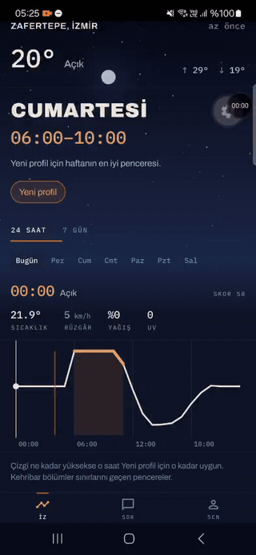
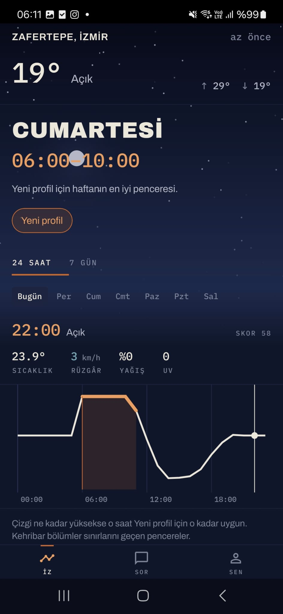
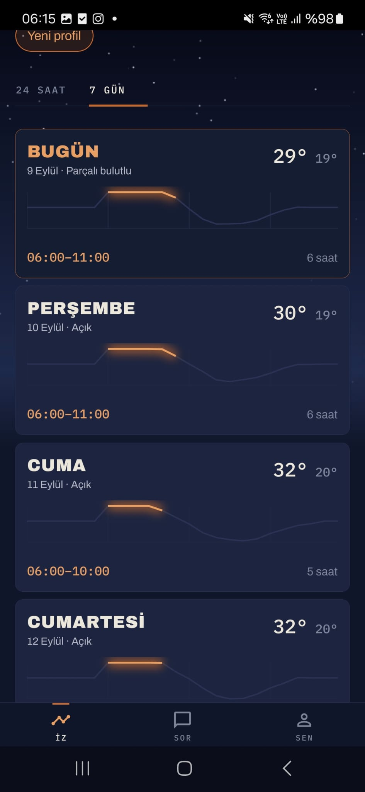
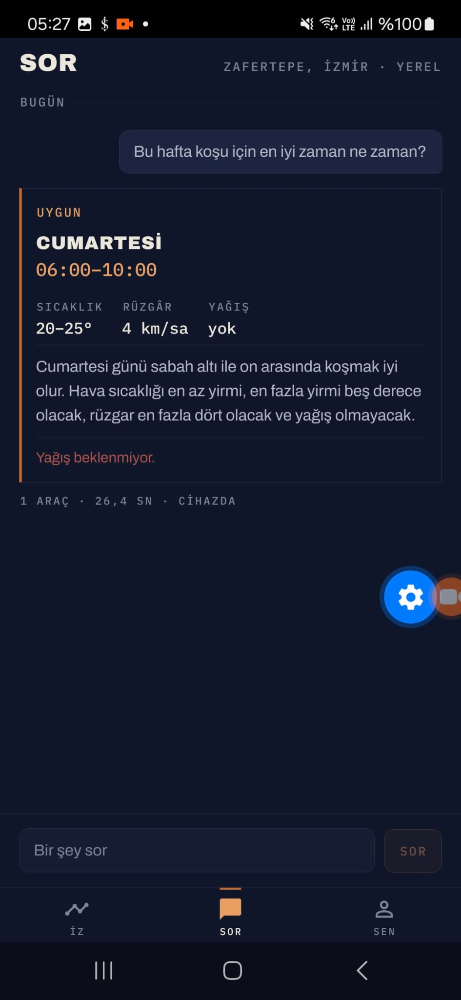
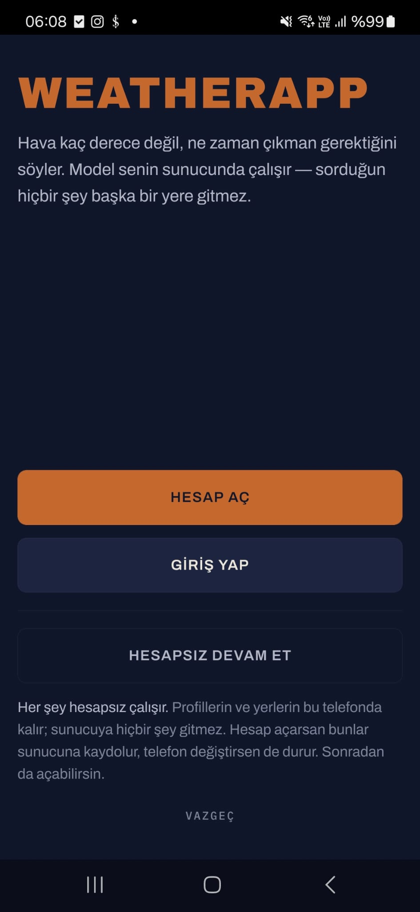
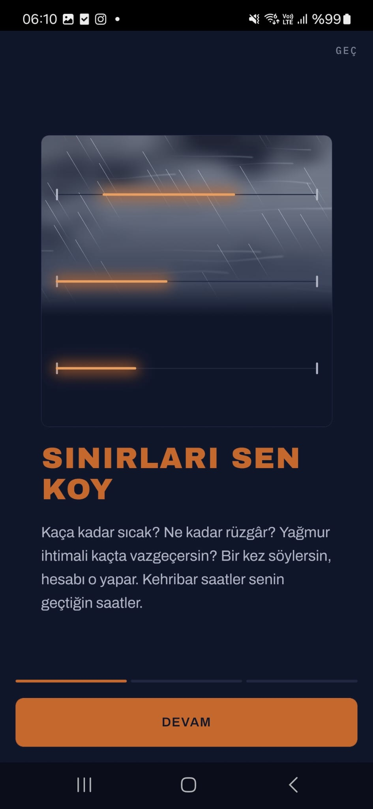

# WeatherApp

A weather app that answers a different question: **not what the weather is, but when to go.**

Set what you will actually go out in — how warm, how much wind, what chance of rain, which
hours you prefer — and it finds the stretches that clear all of it, with the reason every
other hour lost points. Then ask it anything the chart does not answer, in your own words:
*"is the weekend any good for a picnic?"*

The assistant that reads that sentence runs **entirely on your own machine**. No hosted
model, no API key, no request that leaves the server you run it on.



*Dragging across the day moves the sky as well as the numbers. The line is not
temperature — it is how well each hour suits what you are doing, and the amber stretches
are the ones that clear your limits.*

| | | |
|---|---|---|
|  |  |  |
| **İz** — the day, scrubbable hour by hour, with the sky behind it reading the same forecast | **7 gün** — each day burned onto a card from the instrument | **Sor** — the assistant, running on your own hardware, and saying so |

| | |
|---|---|
|  |  |
| **The gate** — the name is scorched onto a recorder card by a travelling point of light, which is what a Campbell–Stokes recorder does with sunshine. There is no weather here on purpose: no place has been chosen yet, and a sky standing for nothing is what [ADR-0013](docs/adr/ADR-0013-data-driven-atmosphere.md) refuses | **The tour** — three cards on a turning drum, each running the real atmosphere on a named specimen. It explains that the line is not temperature, which is the one thing nobody discovers by tapping |

## Why it is built this way

A weather app that fetches JSON and renders a list demonstrates nothing, so the
interesting parts are deliberately elsewhere.

- **The model never computes a number you see.** Scoring, comparison and window selection
  are ordinary tested Python. The model interprets your sentence and phrases the answer —
  that is all. It removes a whole class of confident, invisible errors
  ([ADR-0007](docs/adr/ADR-0007-deterministic-scoring-engine.md)).
- **Tool calling and structured output are separate model calls.** Combined in one
  request, tool calling drops from 75% to 0% on a 4B model. Measured, not assumed
  ([ADR-0006](docs/adr/ADR-0006-two-phase-tool-and-schema.md)).
- **Seven gates stand between the model and you.** An answer that names a figure the tools
  never returned, invents a condition, gets a weekday wrong, contradicts its own verdict,
  comes back in the wrong language or leaks an internal identifier is rejected. It gets one chance to repair; then the scoring
  engine answers instead, in plainer words, and you are not told anything went wrong
  because nothing you need went wrong.
- **Most requests never reach the model at all.** A three-tier router answers common
  questions deterministically in milliseconds, which is faster, more reliable, and still
  works when the assistant is off ([doc 06](docs/06-request-routing.md)).
- **One schema, three consumers.** The API contract, the client types and the model's
  constrained-decoding format are generated from the same JSON Schema, so they cannot
  drift apart ([packages/schema](packages/schema)).
- **Two languages, and the assistant is told which.** The interface and the answers use
  the language you chose, and the server rejects a reply that comes back in the other one.
  While it was inferred from the question it drifted, and nothing could check it — the
  check and the guess would have shared a word list
  ([ADR-0018](docs/adr/ADR-0018-language-is-chosen-not-detected.md)).
- **It works without an account, and without a network.** Guest mode is the design rather
  than a trial: profiles live on the device until you ask for them to live anywhere else
  ([ADR-0009](docs/adr/ADR-0009-jwt-auth-with-guest-mode.md)). The last answer to each
  question is cached on the phone, so the app opens and draws with the server asleep
  ([ADR-0016](docs/adr/ADR-0016-cache-the-scored-plan.md)).
- **The sky is a second reading of the same forecast.** Precipitation sets its density,
  wind the angle it falls at, cloud cover flattens the light, and the sun's real elevation
  moves the gradient. It is not decoration, and it is held to that
  ([ADR-0013](docs/adr/ADR-0013-data-driven-atmosphere.md)).

## What is measured

Two suites, and both keep their negative results.

**The agent**, over recorded fixtures at temperature 0, in Turkish and English
([doc 08](docs/08-evaluation-strategy.md)):

| | |
|---|---|
| Runs passing every check | 20/20 |
| Answered by the model | 80% — the rest are refusals, which is the designed behaviour |
| **Reached the user wrong** | **0** |
| Median answer time | 41.7s, on an M-series laptop, for a question that reaches the model (2026-09-05) |

CI gates on the last row rather than on the headline. A fallback is the system working; a
wrong answer reaching a person is a defect at any rate. A suite that fails on every flake
gets switched off rather than fixed.

**The model**, for what this application needs from it rather than for general capability
([benchmarks/](benchmarks)). Both findings below would have failed silently in production:

| Measurement | Result |
|---|---|
| Schema enforced, GGUF engine | 100% |
| Schema enforced, MLX engine | **0%** — `format` is dropped with no error |
| Tool calling, tools only | 75% |
| Tool calling, tools **and** schema together | **0%** |

Reproduce them:

```bash
python3 benchmarks/engine_check.py gemma4:e4b --repeat 3
python3 benchmarks/run.py gemma4:e4b --repeat 3
python3 evals/run.py --repeat 3
```

## Running it

```bash
# Linux server — everything in containers, model included
./install.sh
```

```bash
# macOS — Ollama runs on the host, because containers there have no Metal access and
# an Ollama container is slow enough to feel broken (ADR-0010)
brew install ollama && ollama serve && ollama pull gemma4:e4b
./install.sh --host-model
```

The script writes `.env`, generates the secrets once, pulls the model, and waits for
`/ready` rather than `/health` — the difference being whether the assistant is actually
there. `docker compose up` still works and is what the script runs; it just needs those
three things done first, and each of them fails in a way that looks like something else
([doc 09](docs/09-deployment.md)).

Then the app:

```bash
npm install
npm run mobile
```

The phone finds the API by itself: with no `EXPO_PUBLIC_API_URL` set, it borrows the
address of whichever machine is serving the bundle.

For a tighter loop on the service, `npm run api` runs it outside Docker. It binds every
interface, because `uvicorn` otherwise listens on loopback only and the app then cannot
reach it from a phone on the same network — which looks exactly like the app being broken.
It reads `services/api/.env` if there is one and falls back to the root `.env`, so the same
secret can serve both paths.

## Layout

```
apps/mobile/       Expo app — React Native, TypeScript, Skia, Reanimated, Drizzle
services/api/      FastAPI service, scoring engine, planning agent, accounts
packages/schema/   JSON Schema → Pydantic + Zod. One definition, three consumers
benchmarks/        Local model measurements
evals/             Agent evaluation scenarios
docs/              How it works, and why each decision went the way it did
```

## Documentation

`docs/` is the reasoning, not a summary of the code. Start at
[docs/README.md](docs/README.md).

The numbered documents explain how each part works; `docs/adr/` records the decisions with
the alternatives that lost. Several of them are more interesting than the code:

- [Local LLM research](docs/05-local-llm-research.md) — why a 4B model, and what breaks at
  that size
- [Request routing](docs/06-request-routing.md) — deciding when *not* to call a model
- [Evaluation strategy](docs/08-evaluation-strategy.md) — how we know the agent works, and
  the three defects the suite found on its first run
- [Design language](docs/10-design-language.md) — the instrument direction, and why the
  ink follows the light
- [Data model](docs/12-data-model.md) — two stores that are deliberately not the same
  schema

Every document ends with a "Still open" section, and they are kept honest.

## Status

Working end to end, and not finished.

**Built:** the scoring engine and its tests; the planning agent with its gates, repair and
fallback; the evaluation suite; the API including accounts, rotating refresh tokens and
rate limiting; the mobile app — the trace, the week, the assistant, the account screen,
the gate and a tour — in two languages, with a device database, offline plans, guest mode
and the handoff into an account. 241 tests on the server, 88 on the app, and both suites
run in CI along with the evaluation of the agent.

**Not built:** notification rules. Password reset, which needs mail infrastructure a
self-hosted instance may not have and is
[documented rather than half-implemented](docs/07-auth-and-security.md). Extracting a
profile from a sentence — the schema describes profiles that way and no endpoint does it;
limits are edited as fields. And no component tests: the hooks and the domain logic are
covered, but nothing would notice a screen rendering the wrong thing.

## Licence

MIT.
